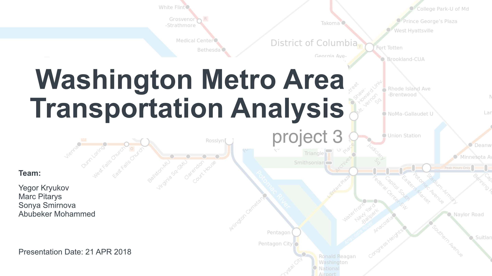
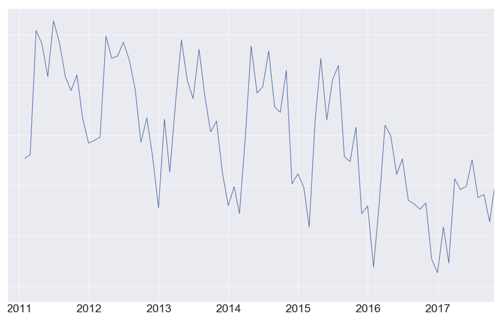
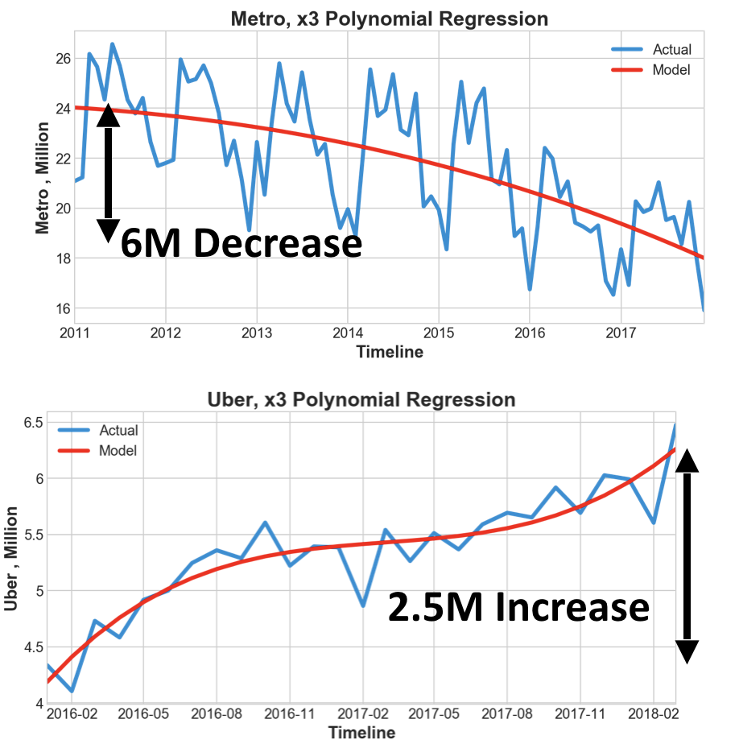
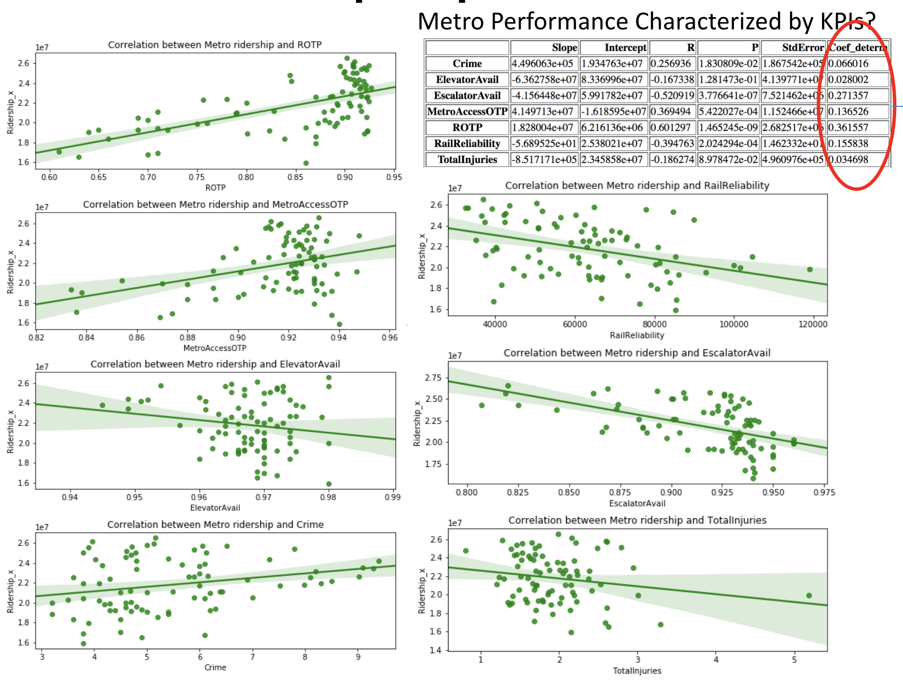
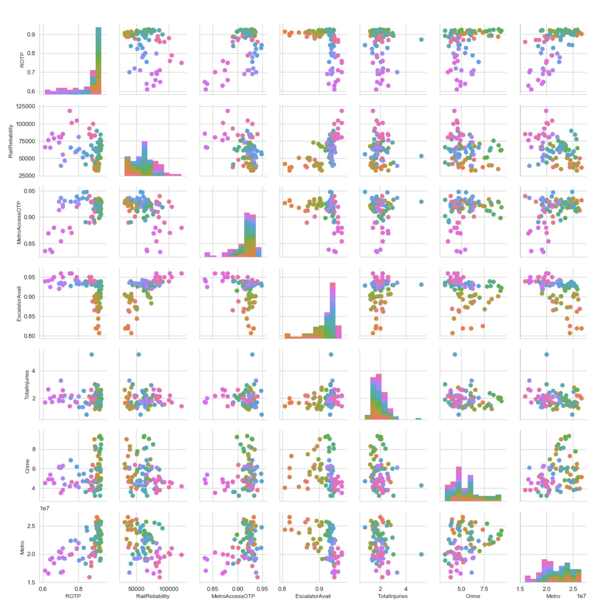

# Washington Metro Area Transportation Analysis

## What
The Washington Metropolitan Transit Authority (WMATA) provides bus and rail transit to the Washington region
## Why
Transporting over **300,000,000** passengers a year WMATA is facing many challenges concerning safety, ridership, and funding
## Bottomline
Why Metro ridership is declining?  What factors impact Metro performance and does Metro impact other transportation resources?

### **Is metro getting better or other ways of transportation are taking over its customers?**

---
## Data
WMATA API provides only live data
Use DC area transportation data from WMATA, Taxi and Uber to understand relationships between metro performance and the use of other modes of transportation
Gather monthly ridership data for determining time of year impacts

---
## Questions

### Q1: Does time of year impact demand for transportation resources? **Yes**

The graph of the ridership data is characteristic of a time series.
1. Long Term Trend or Movement
2. Seasonal Movement
3. Long-Term Cyclical Movement
4. Irregular Movement

Seasonal Variation Found by the Average Percentage Method
1. Each month ridership data expressed as a percentages for the whole year ridership.
2. Percentages from corresponding months of different years are averaged.
3. The resulting twelve percentages are the seasonal index. 
---
### Q2: Does Metro performance impact the demand for other transportation resources? 
Conclusion:  Analysis indicates Metro is losing passengers to Uber and some other mode of transportation other than taxi or bus.  Perhaps then number of drivers are increasing:

---
### Q3: Can one predict the availability of transportation resources based on metro past performance?

No strong relationships between KPIs and Ridership

---

## Outcome & Recommendations

- Time of year impacts Metro demand

- Metro ridership loosing customers to other means of transportation even though economy is strong, and government employees get 100% refunds for rides
- Metro&Bus lost 600K customers and Uber got 1.4M customer.  Where those additional customers come from?
- Current metro KPIs are not significant factors in ridership numbers, however the Rail On Time Performance KPI has the strongest impact on Metro Ridership
### What now?
Metro needs to share their data better and if metro wants more customers it should probably measure different set of KPIs
### What if we had more time? :)

Find individual vehicles/Lyft/other Taxi ridership data and compare to other cities

---

## Team Members

- Yegor Kryukov (solution architecture, polynomial regression funcrions, bus data)
- Marc J. Pitarys (presentation, statistics and models, metro data)
- Sonya Smirnova (linear regression functions and plots, ride-sharing companies data)
- Abubeker Mohammed (idea, taxi data)

